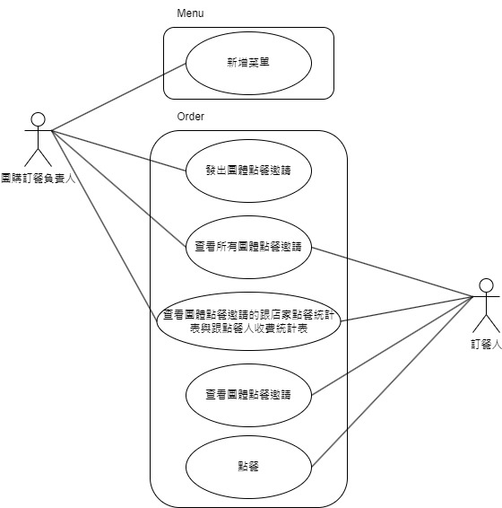
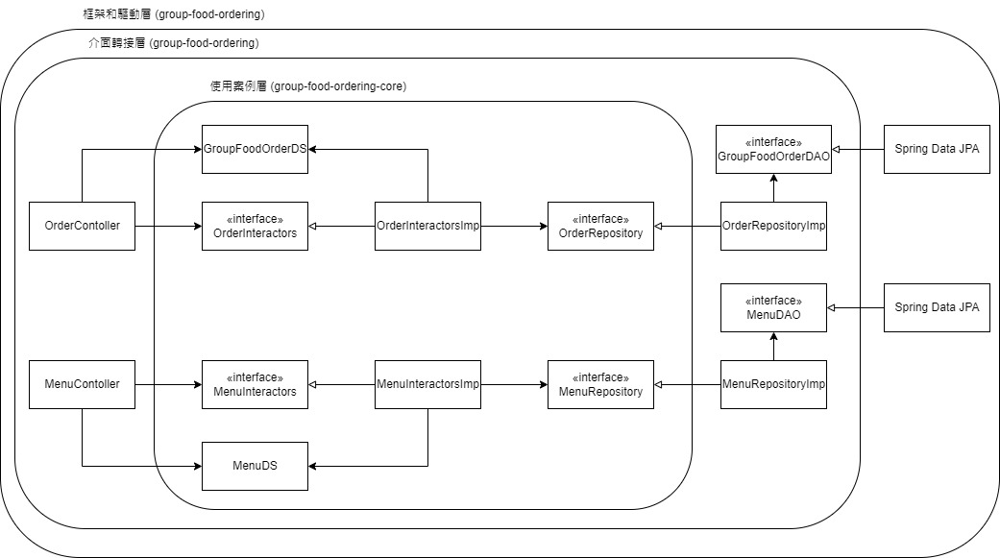

# Group Food Ordering Core

Group Food Ordering 為解決團體訂餐的困擾而成。

**P.S.**
1. 此專案為策略核心，細節需自行實作，也可自行實作，細節實作請參照 [group-food-ordering](https://github.com/johnlin1066/group-food-ordering) 。
2. 此專案使用前後端分離， View 細節實作請參照 [group-food-ordering-fe](https://github.com/johnlin1066/group-food-ordering-fe)。

## 需求
團體訂餐負責人想要增快目前的點餐速度，簡化點餐流程。

點餐流程
1. 團體訂餐的負責人發送菜單至群組
2. 等待訂餐期限到期後，依據群組的點餐訊息，需要統計兩份表，一份用來跟店家點餐與付費，另一份用來跟點餐人收費

---

* 團購訂餐負責人新增菜單
* 團購訂餐負責人發出團體點餐邀請
* 訂餐人查看團體點餐邀請
* 訂餐人點餐
* 團購訂餐負責人與訂餐人可以查看所有團體點餐邀請
* 團購訂餐負責人與訂餐人可以查看團體點餐邀請的跟店家點餐統計表與跟點餐人收費統計表

## 設計
### 領域設計

### 架構設計 (使用 Clean Architecture 架構設計)

